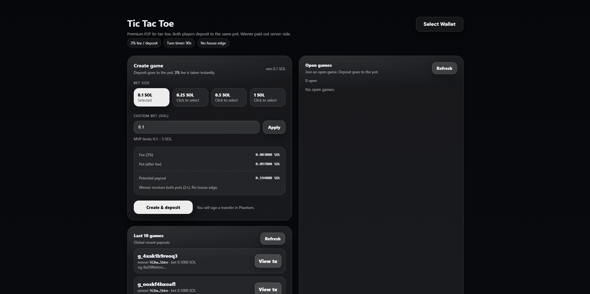

# PvP TicTacToe ⚡

Minimal on-chain PvP TicTacToe built on Solana.

Simple mechanics. Competitive play. Clean execution.

## Live

https://pvptictactoe.vercel.app/

---

## Preview



---

## Overview

PvP TicTacToe is a real-time two-player game built on Solana.

Players connect their wallets, join a match, and compete in a classic TicTacToe format with transparent game state handling.

The focus:

- Clear game logic
- Deterministic outcomes
- Minimal UI
- Permissionless participation

No unnecessary complexity.

---

## Features

- Real-time PvP gameplay
- Wallet integration (Phantom)
- Transparent move validation
- Automatic win detection
- Clean minimal interface
- Fast game reset

---

## How It Works

1. Player creates or joins a game
2. Players alternate turns
3. Moves are validated
4. Win or draw is determined automatically
5. Game resets for next round

Flow:

Client → Wallet → Game state → Validation → UI update

---

## Stack

- Next.js
- TypeScript
- Solana Web3.js
- Vercel

---

## Run Locally

```bash
npm install
npm run dev
